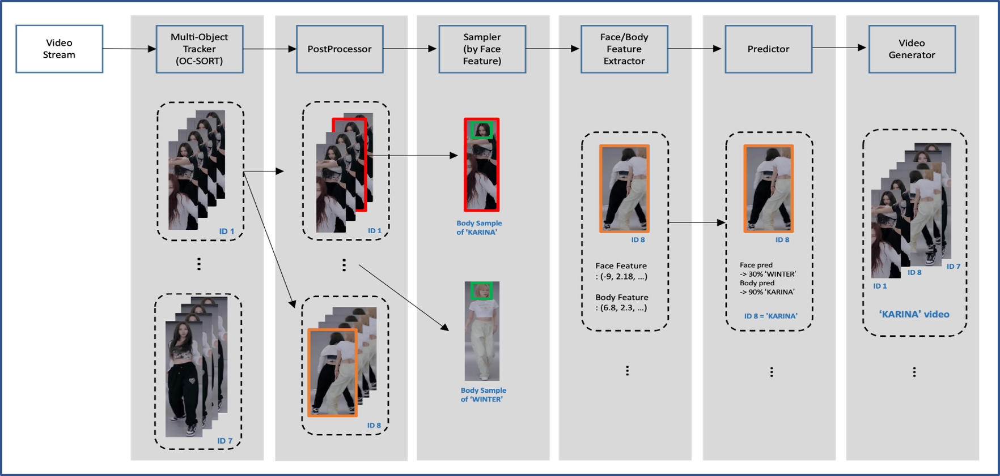

# Torch K-pop

  
## 1. Introduction

### Problem statement
It is impossible to create an idol model's Facecam with a current MOT model.  
This is because the idol model's videos have occlusions from dance moves, nonlinear movements, and camera movement.  
However, We solved this problem by adding a face recognition model and a re-identification model to the tracking model.
  
### Abstract
  
We approached the problem by connecting deep learning models in series.  
The ID given through tracking is re-identified through a face recognition model and a re-identification model.  
Through this, the same id was reallocated to the same person.  
### Key features
* OC-SORT is used as a tracking model.
This is because the id-switch phenomenon can be minimized only by using a motion-sensitive tracking model.   

* If the IOU between id after tracking is high, id-switch may occur, so id was assigned as a new ID in this case.

* An optimal bbox with a low IOU was found, sampled, facial features were extracted, and idol groups were identified.

* Identify people in the bbox through face detection and face recognition in the bbox of the tracking model.

* In the case of a scene without a face (a turning scene) while dancing, the re-identification model is used to judge the same person by the similarity of physical characteristics.

* Designed to produce artificial or natural video using either eye-to-eye point tracking and smoothing techniques.
## 2. Installation

### 1) Requirements
<font color='red'>※ torchkpop dependent on ffmpeg v5.0</font>  

ffmpeg v5.0 update [Link](https://ubuntuhandbook.org/index.php/2022/02/install-ffmpeg-5-0-ubuntu/)  
```
# not command in conda or virtual env
sudo add-apt-repository ppa:savoury1/ffmpeg5
sudo add-apt-repository ppa:savoury1/ffmpeg4
sudo apt update
sudo apt full-upgrade
```


install library 
```
conda create -n torchkpop python=3.7
conda activate torchkpop
conda install cudatoolkit=11.0.3 -c conda-forge
conda install cudatoolkit-dev=11.6.0 -c conda-forge 
pip install torch==1.9.0+cu111 torchvision==0.10.0+cu111 torchaudio==0.9.0 -f https://download.pytorch.org/whl/torch_stable.html
pip install mmcv-full -f https://download.openmmlab.com/mmcv/dist/cu111/torch1.9.0/index.html
pip install mmdet
cd mmtracking
pip install -r requirements/build.txt
pip install -v -e .
cd ..
pip install pytube
pip install onnxruntime
pip install onnxruntime_gpu
pip install ffmpeg-python
pip install neptune-client
pip install wandb
pip install clearml
pip3 install tabulate
pip install yacs
pip install torchmetrics
pip install monai
pip install gdown
pip install insightface
pip install natsort
pip install plotly
pip install moviepy
```
### 2) Download pretrain weight  
Download the files below under the pretrained_weight folder.  
[OC-SORT](https://drive.google.com/file/d/1MW8jcmEZ1ZyzOsM6ro_BPICqG9oIXQ4m/view?usp=sharing): MOT model weight  
[Face embedding](https://drive.google.com/file/d/1_PJs7Rbq2Rg6kgvyefKYB3BC8JB1R7v5/view?usp=sharing): only newjeans and asepa are now supported.  
[Face detection model weight](https://drive.google.com/file/d/1JewWuc78KW7KY6MQ99cO52ZGVRk9pkRq/view?usp=sharing): Face Detection model weight.  
[Face Recognition model weight](https://drive.google.com/file/d/1kmtHgg0HeHbmp4O1bgNIodYYB-HKWXKv/view?usp=share_link): Face Recognition model weight.  
[Re-identification](https://drive.google.com/file/d/1TGzI4C5HchwIftjM9vh8eeO85DyLWRgV/view?usp=share_link): Re-identification model weight.  
  
## 3. Inference 
```python
python3 main.py # default inference 
python3 main.py --smoothing # smoothing apply inference 

python main.py [--url ${YOUTUBE_URL}] [--start ${START_SECOND}] [--end ${END_SECOND}] [--member ${GROUPNAME_MEMBERNAME}] [--smoothing]
```
## 4. Technical details
  
### 1) Tracker
Tracking is done by OC-SORT.
We used a prerain weight in the hard augmentationed crowd-human data set.  
we gave soft-augmentation and fine-tuned it.  
However, due to the limitation of the tracking model,  
more id can be assigned than the number of people in the group appearing in the video and id-switch can also occur.
  
### 2) Postprocesser
The Postprocessor performs three roles.  
First, for severe overlap, give a new ID.  
an id with iou detected above threshold is given a new ID.  
this is for prevent id-switch.  
Second, Add information about the overlap of the bbox and whether the bbox is on the front.  
because this information support that sampler can choose the appropriate sample.  
Third, delete the short time detected id below threshold.  
because there's a possibility that short time detected id is a noise.  
  
### 3) Sampler
Sampler extracts samples that are optimal for extracting features per id (without overlapping bboxes).  
Among the extracted samples, the image with the best Face-Recognition results is used as the Body Anchor.  
This is because images with good facial recognition results without overlapping bboxes are more likely to show good full-body characteristics.
  
### 4) Group Recognizer
The group recognizer uses a voting method.  
Face detection and recognition of sampled images is performed by Sampler.  
And the group is judged by voting for the group with the highest similarity to pre-stored group embeddings.  
  
### 5) Face Feature Extractor
The Face Feature Extractor is performed on a bbox detected in the tracing model in all frames.  
The procedure for performing the Face Feature Extractor is as follows.  
First, Detect face in tracking bbox.  
Second, Extract feature from the detected Face bbox  
Third, Compare the similarity with the Face Feature embeddeding of the pre-learned group to determine the most likely member.  
  
### 6) Body Feature Extractor
The body extractor operates in the following order.  
First, the body feature average of some samples with high face recognition results  
among the images selected from the sampler is made into a body anchor.  
Second, for all tracking bboxes, the body feature is extracted and compared with the body anchor to predict the members.
  
### 7) Predictor
One member is assigned per id based on the similarity of body and face by predictor.  
Divide the results of face recognition into three categories to judge the importance of face and body similarity differently.  
First, if the face confidence score is high.  
Assign members to id using only face recognition results.  
Second, if the face confidence score is in the middle.  
Allocate the members by considering the balance of body and face similarity.  
Third, if the face confidence score is low.  
Assign members using only the similarity result of the body feature.  
After the predication process, only one member is assigned to one id.  
  
### 8) Video Generator
Video Generator is responsible for calibrating the model's predictions and editing the results to ensure they are well communicated to the user.  
There are three most important roles.  
First, the center of the image is designated as the middle of the forehead to create an image concentrated on the face.  
Second, when model failed detect member, video generator makes video shows the entire screen.  
However, it interpolates the moment when it cuts off so that it can change slowly.  
Third, if the user wants a natural image, smoothing the trajectory.  
  
## 5. Contributors
[brotherhoon-code](http://github.com/brotherhoon-code)  
[chjcode](http://github.com/chjcode)  
[iden2t](http://github.com/iden2t)  
[qwer55252](http://github.com/qwer55252)  
[ydsong2](http://github.com/ydsong2)  
  
## Presentation Video  
[Presentation Youtube(Korean)](https://www.youtube.com/watch?v=S3UVk0QvYDI)  
